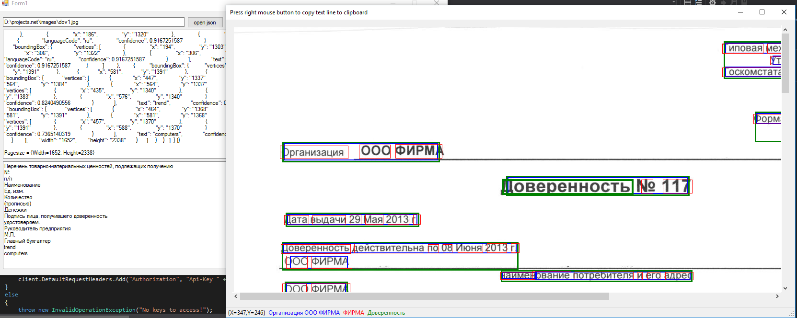

# Yandex-Vision-API-.net-example
Sabich Gregory 2019

Newtonsoft.Json
The MIT License (MIT)
Copyright (c) 2007 James Newton-King https://www.newtonsoft.com/json

This project is an example of how to use Yandex.Vision from Yandex.Cloud
https://cloud.yandex.ru/services/vision
Please read rules before using Yandex services
https://yandex.ru/legal/cloud_oferta/
https://yandex.ru/legal/cloud_aup/

This solution was made as example of "how to" work with OCR recognition from Yandex - Yandex Vision service.

First you need to read basic instruction - about what you will work with and how to get authentication options: https://cloud.yandex.ru/docs/vision/

There (in main class JYCR) you need to change 3 items:

folderID - your folder in yandex cloud service

token or apikey - authentication data for your account: https://cloud.yandex.ru/docs/iam/operations/api-key/create https://cloud.yandex.ru/docs/iam/operations/iam-token/create

lang - language in "['ru','en', ...]" format (https://cloud.yandex.ru/docs/vision/concepts/ocr/supported-languages)

Example - how to work with JYCR "JYCT_Test" - simple winform application. 

"open json" - open json response (text file) (from something like "curl").

"parse" - parse json response into text.

"open image -> online rec" - recognize image using .net httpclient.

"show image" - after online recognizing this will open image with rectangles over text strings and words. 

Toolbar will show value of string and word while mouse pointer on it.
Right click on mouse will copy word value to buffer.

Note that there are two methods to get recognition result - async and sync:
JYCR.ycRecognizeImageASYNC(fName) and JYCR.ycRecognizeImageSYNC(fName).

With async operation you car run multiple recognition tasks.

This project is an example, so you are free to use it any way you like as a starting point for your yandex vision based solutions.

[link] (Json.YC.Reader/JYCR.cs)
